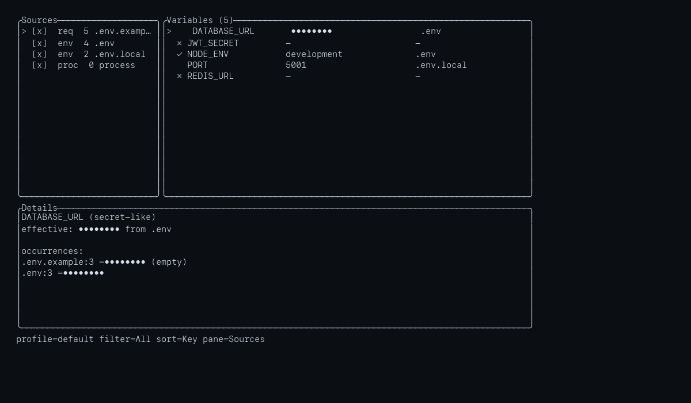

# EnvLens

[](https://github.com/EricGrill/envlens/actions/workflows/ci.yml)
[](#license)
[](https://github.com/EricGrill/envlens/releases)

EnvLens is a Rust TUI and CLI for inspecting, comparing, and debugging environment variables across project config sources.



## Features

- Discovers `.env*` files, example templates, Docker Compose files, package scripts, flat GitHub Actions/GitLab env blocks, recognized CI config files, and the current process environment.
- Shows a three-pane TUI with sources, variables, and selected-variable details.
- Computes effective values with deterministic precedence and optional profiles/source filters.
- Flags duplicate keys, conflicting values, missing required variables, empty required values, invalid dotenv lines, undefined and circular references, unresolved inherited compose variables, shadowed values, and tracked-file secrets.
- Detects secret-like keys and values, masks secrets by default, and keeps CLI/report exports sanitized.
- Provides `check` for CI gating and `report` for sanitized markdown or JSON output.
- Supports `.envlens.yml` configuration for ignores, required keys, custom secret patterns, precedence, failure threshold, and profiles.

## Install

From a GitHub release tarball:

```sh
curl -L https://github.com/EricGrill/envlens/releases/download/v0.1.0/envlens-x86_64-unknown-linux-gnu.tar.gz | tar xz
sudo mv envlens /usr/local/bin/
```

Use the matching archive for your platform from the
[v0.1.0 release](https://github.com/EricGrill/envlens/releases/tag/v0.1.0).

From Git:

```sh
cargo install --git https://github.com/EricGrill/envlens
```

Crates.io publishing is deferred for v0.1.0.

## Quick Start

Open the TUI for the current directory:

```sh
envlens
```

Check a project in CI or a script:

```sh
envlens check
envlens check --strict
envlens check --json --no-values
```

Generate a sanitized report:

```sh
envlens report --format markdown --out envlens-report.md
envlens report --format json --no-values
```

Minimal GitHub Actions example:

```yaml
name: envlens
on: [push, pull_request]
jobs:
  envlens:
    runs-on: ubuntu-latest
    steps:
      - uses: actions/checkout@v4
      - uses: dtolnay/rust-toolchain@stable
      - run: cargo install --git https://github.com/EricGrill/envlens
      - run: envlens check --strict --no-values
```

Common options:

```sh
envlens [PATH] [--profile NAME] [--source SOURCE]... [--ignore DIR]... [--config FILE] [--no-color] [--ascii]
envlens check [PATH] [--json] [--strict] [--no-values]
envlens report [PATH] --format markdown|json [--out FILE] [--no-values]
```

## Keybindings

| Key | Action |
| --- | --- |
| `q` | Quit |
| `?` | Open help |
| `Up` / `Down`, `j` / `k` | Move selection |
| `Tab` | Switch panes |
| `/` | Search variables by key |
| `Esc` | Close modal/menu, clear search, then re-mask revealed values |
| `f` | Cycle filters: all, warnings, missing, conflicts, secrets |
| `s` | Open sort menu |
| `Space` | Toggle selected source when the sources pane is focused |
| `Enter` | Expand or collapse selected variable details |
| `r` | Reveal or re-mask the selected secret-like variable |
| `R` | Reveal all secret-like values after confirmation |
| `e` | Export a sanitized markdown report |
| `o` | Open the effective source in `$EDITOR` when available |
| `Ctrl+r` | Re-scan the project |

## Configuration

EnvLens discovers the first project config found in this order:

1. `.envlens.yml`
2. `.envlens.yaml`
3. `.config/envlens.yml`

It also merges user config underneath project config, resolved from `$XDG_CONFIG_HOME/envlens/config.yml` when `XDG_CONFIG_HOME` is set and `~/.config/envlens/config.yml` otherwise. Project keys override user keys; lists replace rather than concatenate. `--config FILE` bypasses discovery.
```yaml
ignore: [tmp, generated]                # Extra directory names to skip while scanning.
required: [DATABASE_URL, NODE_ENV]      # Required variables in addition to example files.
required_from_examples: true            # Treat .env.example/.sample/.template keys as required.
secret_patterns: ["SUPABASE_.*"]        # Additional regexes for secret-like keys.
precedence: [.env, .env.local, process] # Ordered lowest to highest; listed sources rank above unlisted defaults.
fail_on: error                          # error or warning; --strict is equivalent to warning.
profiles:
  dev:
    include: [.env, .env.local, process]
  test:
    include: [.env, .env.test, process]
```

Unknown config keys produce warnings. Malformed config falls back to defaults so zero-config use still works.

## Precedence

Default precedence is lowest to highest:

1. `.env`
2. `.env.local`
3. `.env.development`
4. `.env.development.local`
5. `.env.test`
6. `.env.test.local`
7. `.env.production`
8. `.env.production.local`
9. Docker Compose sources
10. package scripts
11. process environment

Example/template files define required keys and do not supply effective values. CI env blocks are informational in v0.1.0 and do not supply effective values. A profile's `include` list is also ordered lowest to highest; explicit `precedence` entries win for sources they name.

## Exit Codes

| Code | Meaning |
| --- | --- |
| `0` | No findings at the active failure threshold |
| `1` | `check` found diagnostics at the active threshold |
| `2` | Invalid invocation, unknown profile, or unknown source |
| `3` | Target path missing or unreadable |
| `4` | Internal error or TUI startup failure |

`check` fails on error diagnostics by default. `--strict` and `fail_on: warning` also fail on warnings. `report` writes a document and exits `0` when rendering succeeds, even if the report contains findings.

## JSON Output

`envlens check --json` and `envlens report --format json` emit:

```text
{
  version,
  generated_at,
  root,
  profile,
  summary: { sources, variables, errors, warnings, infos, secrets, missing_required },
  sources,
  variables,
  diagnostics
}
```

Use `--no-values` to omit value-bearing fields entirely.

## Security Posture

- Secret-like values are masked by default in the TUI, CLI output, JSON, markdown reports, diagnostics, config warnings, and panic output.
- Revealing values is TUI-only, transient, and never written by report/export paths.
- EnvLens has no network dependencies and does not make network calls.
- EnvLens has no telemetry.
- See [SECURITY.md](SECURITY.md) for vulnerability reporting and public test-data guidelines.

## License

EnvLens is licensed under either of:

- MIT ([LICENSE-MIT](LICENSE-MIT))
- Apache License, Version 2.0 ([LICENSE-APACHE](LICENSE-APACHE))

at your option.
